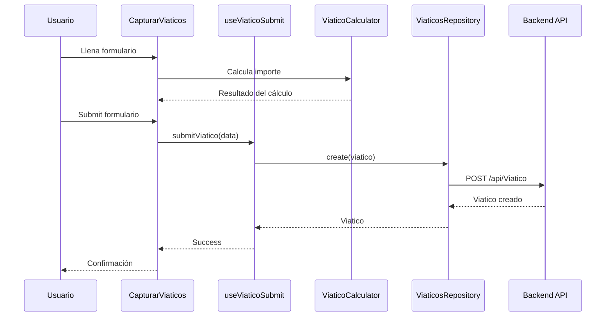

# Arquitectura del Sistema

## Diagrama de Capas
```
┌─────────────────────────────────────────────┐
│           CAPA DE PRESENTACIÓN              │
│  (Componentes React, Páginas, Layouts)      │
└──────────────────┬──────────────────────────┘
                   │
┌──────────────────▼──────────────────────────┐
│           CAPA DE HOOKS                     │
│  (Custom Hooks, Lógica de UI)               │
└──────────────────┬──────────────────────────┘
                   │
┌──────────────────▼──────────────────────────┐
│      CAPA DE SERVICIOS DE DOMINIO           │
│  (ViaticoCalculator, Validators, Utils)     │
└──────────────────┬──────────────────────────┘
                   │
┌──────────────────▼──────────────────────────┐
│         CAPA DE REPOSITORIOS                │
│  (Interfaces + Implementaciones)            │
└──────────────────┬──────────────────────────┘
                   │
┌──────────────────▼──────────────────────────┐
│           CAPA DE API                       │
│  (HttpClient, Axios)                        │
└──────────────────┬──────────────────────────┘
                   │
┌──────────────────▼──────────────────────────┐
│           API BACKEND                       │
│  (ASP.NET Core Web API)                     │
└─────────────────────────────────────────────┘
```

## Flujo de Captura de Viático


## Responsabilidades por Capa

### 1. Capa de Presentación
**Responsabilidad:** Renderizar UI y capturar eventos del usuario

**Componentes:**
- `CapturarViaticos` - Orquestador principal
- `ViaticoForm*` - Componentes de formulario
- `TableListadoViaticos` - Listado de viáticos

**Reglas:**
- No contienen lógica de negocio
- Solo manejan estado de UI local
- Delegan lógica a hooks

### 2. Capa de Hooks
**Responsabilidad:** Conectar UI con lógica de negocio y estado global

**Hooks:**
- `useViaticoForm` - Estado del formulario
- `useViaticoCalculation` - Cálculos reactivos
- `useViaticoSubmit` - Envío de datos
- `useViaticosStore` - Acceso al store

**Reglas:**
- Orquestan llamadas a servicios
- Manejan efectos secundarios
- Sincronizan con Redux

### 3. Capa de Servicios de Dominio
**Responsabilidad:** Lógica de negocio pura

**Servicios:**
- `ViaticoCalculator` - Cálculos de viáticos
- `UbicacionValidator` - Validaciones de ubicación
- `DateUtils` - Utilidades de fecha

**Reglas:**
- Sin dependencias de UI
- Funciones puras cuando sea posible
- Testeables en aislamiento

### 4. Capa de Repositorios
**Responsabilidad:** Acceso a datos

**Interfaces:**
- `IViaticosRepository`
- `IEmpleadosRepository`
- `ICatalogosRepository`

**Implementaciones:**
- `ViaticosRepository`
- `EmpleadosRepository`
- Etc.

**Reglas:**
- Implementan interfaces
- Transforman DTOs a entidades de dominio
- Manejan errores de API

### 5. Capa de API
**Responsabilidad:** Comunicación HTTP

**Componentes:**
- `HttpClient` - Cliente HTTP base
- `apiClient` - Instancia configurada

**Reglas:**
- Manejo centralizado de errores
- Interceptores si necesario
- Configuración de headers/auth

## Patrones Implementados

### 1. Repository Pattern
Abstrae el acceso a datos
```typescript
interface IViaticosRepository {
  getAll(): Promise<Viatico[]>;
  create(viatico: Viatico): Promise<Viatico>;
}

class ViaticosRepository implements IViaticosRepository {
  async create(viatico: Viatico): Promise<Viatico> {
    return apiClient.post('/api/Viatico', viatico);
  }
}
```

### 2. Strategy Pattern
Diferentes estrategias de cálculo
```typescript
class ViaticoCalculator {
  private obtenerTarifaDiaria(ubicacion, nivel) {
    // Estrategia según ubicación y nivel
  }
}
```

### 3. Dependency Injection
Inyección de dependencias
```typescript
export const useViaticoSubmit = (
  empleadoId: number,
  calculoActual: CalculoViaticoResult | null,
  // Dependencias inyectadas
) => {
  // ...
}
```

### 4. Custom Hooks Pattern
Reutilización de lógica
```typescript
const { calculoActual, calcularViatico } = useViaticoCalculation(
  ciudades,
  estados,
  paises,
  nivelEmpleado
);
```

## Gestión de Estado

### Redux Store Structure
```typescript
{
  auth: {
    status: 'authenticated',
    user: {...},
    errorMessage: ''
  },
  viaticos: {
    isLoading: false,
    listviaticos: [...],
    viatico: {...}
  },
  empleados: {
    isLoading: false,
    empleados: [...],
    empleado: {...}
  },
  // ... otros slices
}
```

### Estado Local vs Global

**Estado Global (Redux):**
- Datos de autenticación
- Catálogos (empleados, ciudades, etc.)
- Listados de viáticos
- UI global (modales)

**Estado Local (useState):**
- Estado de formularios
- UI transitoria
- Cálculos temporales

## Manejo de Errores

### Capas de Error Handling

1. **API Layer:** HttpClient captura errores HTTP
2. **Repository Layer:** Transforma errores a mensajes de dominio
3. **Hook Layer:** Maneja errores y actualiza UI
4. **Component Layer:** Muestra errores al usuario
```typescript
try {
  await submitViatico(values);
} catch (error: any) {
  alert(error.message || 'Error al procesar el viático');
}
```

## Performance Optimizations

### 1. Memoization
```typescript
const filteredRows = useMemo(() => {
  return rows.filter(/* ... */);
}, [rows, filterText]);
```

### 2. useCallback
```typescript
const calcularViatico = useCallback((destinoId, dias) => {
  // ...
}, [ciudades, estados, paises]);
```

### 3. Code Splitting
```typescript
// Lazy loading de rutas
const CapturarViaticos = lazy(() => import('./pages/CapturarViaticos'));
```

## Testing Strategy (Futuro)

### Unit Tests
- Servicios de dominio (`ViaticoCalculator.test.ts`)
- Utilidades (`DateUtils.test.ts`)
- Hooks personalizados

### Integration Tests
- Repositorios con mock de API
- Flujos de datos completos

### E2E Tests
- Flujo completo de captura de viático
- Flujo de autenticación

## Escalabilidad

### Agregar Nuevos Módulos

1. Crear tipos en `src/types/nuevo-modulo/`
2. Crear repositorio e interfaz
3. Crear servicios de dominio si necesario
4. Crear hooks personalizados
5. Crear componentes

### Modificar Reglas de Negocio

1. Actualizar servicio de dominio
2. Tests unitarios
3. No tocar componentes (desacoplados)

---

**Nota:** Esta arquitectura permite escalar el sistema sin modificar código existente, aplicando el principio Open/Closed.